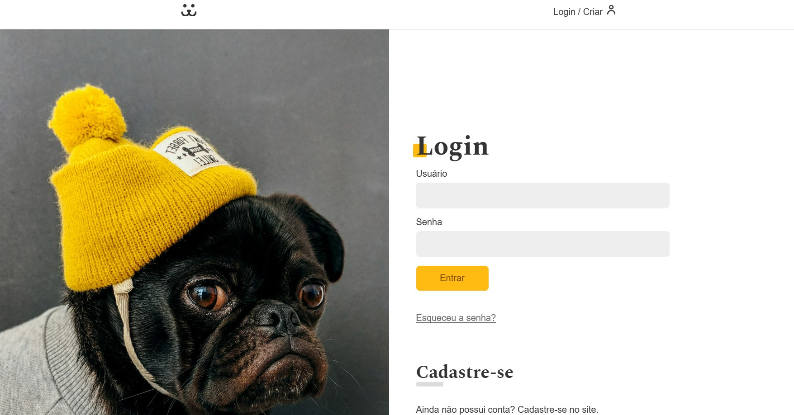

# Projeto: Rede social de Pets



## Descrição do Projeto

Este projeto consiste em uma rede social dedicada a cães, onde os usuários podem se cadastrar, realizar o login e fazer postagens que incluem fotos do cão, nome, peso e idade. Além disso, os usuários podem interagir com as postagens realizando comentários. O projeto foi desenvolvido durante o curso de React da Origamid.

## Tecnologias e Conceitos

O desenvolvimento desta aplicação utilizou um conjunto de tecnologias modernas e conceitos de desenvolvimento React, incluindo:

| Categoria | Tecnologia / Conceito | Detalhes |
| :--- | :--- | :--- |
| **Frontend** | React | Biblioteca principal para a interface do usuário. |
| **Estilização** | Styled Components | Utilizado para componentização e gerenciamento de estilos. |
| **Rotas** | React Router DOM | Gerenciamento de navegação e rotas protegidas. |
| **Gráficos** | Victory chart | Utilizado para a criação dos gráficos de estatísticas do usuário. |
| **Estado/Dados**| Context API / useContext | Gerenciamento de estado global, como informações do usuário e login. |
| **API** | REST API (Origamid) | Consumo de API para autenticação (`/jwt-auth/v1/token`), operações de usuário, fotos e comentários. A URL base da API é `https://dogsapi.origamid.dev/json`. |
| **Hooks Customizados**| `useFetch`, `useForm`, `useMedia` | Lógica de reutilização para requisições de API, validação de formulários e media queries. |
| **Otimização** | Lazy e Suspense | Implementação de carregamento lento para componentes (ex: gráficos de estatísticas). |
| **Build** | Vite | Ferramenta de build moderna e rápida, com plugin para React e SVG como componentes (SVGR). |

### Dependências Principais
As principais dependências do projeto listadas em `package.json` são:

* `react`
* `react-dom`
* `react-router-dom`
* `styled-components`
* `victory`

## Instalação e Execução

Para configurar e executar o projeto localmente, siga os passos abaixo:

### 1. Pré-requisitos
Certifique-se de ter o [Node.js](https://nodejs.org/) e o [Yarn](https://yarnpkg.com/) instalados na sua máquina.

### 2. Clonar o Repositório

```bash
# Se o repositório estiver disponível publicamente, substitua pelo comando de clone
git clone [<URL_DO_REPOSITÓRIO>](https://github.com/alvesxdani/social-network-dogs)
cd social-network-dogs
code . (para abrir no VS Code)
